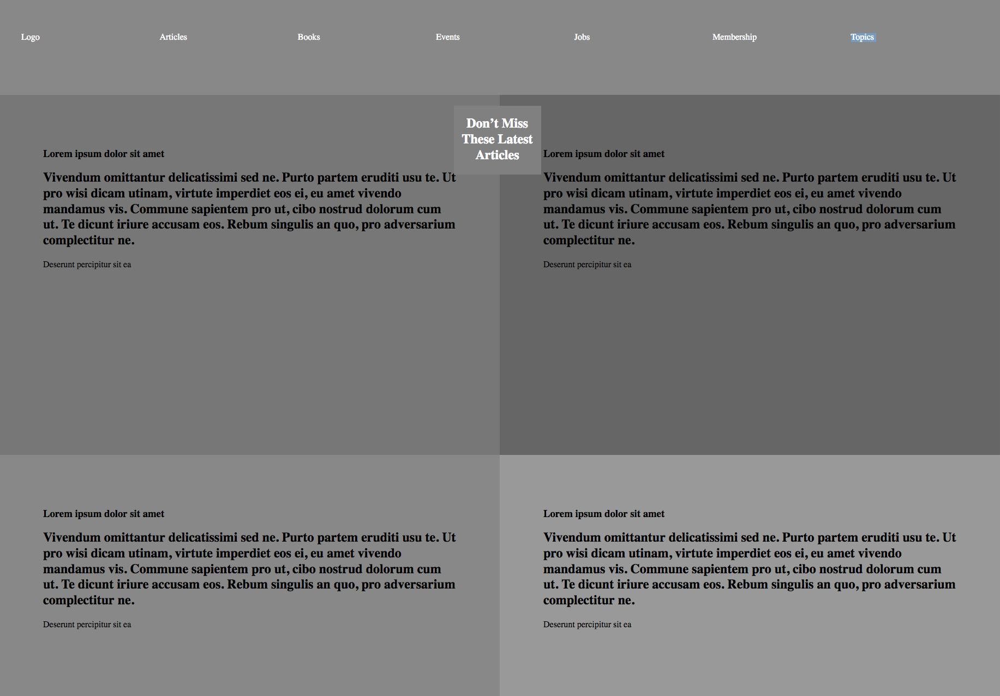

# Design Teardown Project

> A visual heat map of the www.smashingmagazine.com homepage.

Aim of the project is for collaborative learning and continous practice of HTML5 and CSS3. Particular focus was on design hierarchy.

## Built With

- HTML5
- CSS3

## Live Demo

[Live Demo Link](https://kbjude.github.io/design-tear-down)

## To Install and Run ...

- Download all the files to a folder
- Open index.html in a web browser

## Authors

👤 Jude Kajura

- Github: [@kbjude](https://github.com/kbjude)

👤 Paul Omondi

- Github: [@paulo-techie](https://github.com/paulo-techie)
- Linkedin: [paul-o-43051a31](https://www.linkedin.com/in/paul-o-43051a31)

## 🤝 Contributing

Contributions, issues and feature requests are welcome!

Feel free to check the [issues page](issues/).

## Show your support

Give a ⭐️ if you like this project!

## Acknowledgments

- Thanks to Microverse for the learning opportunity ane experience. 

## 📝 License

This project is [MIT](lic.url) licensed.
